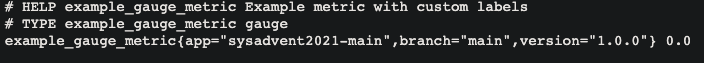
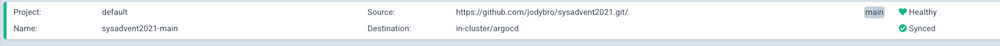
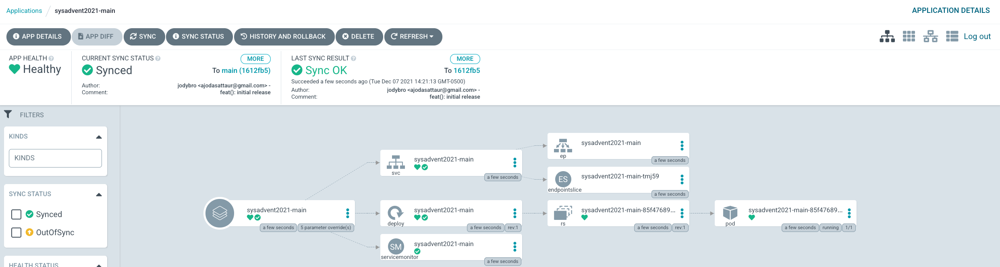
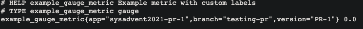
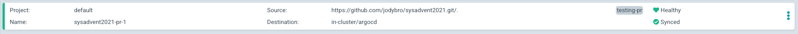
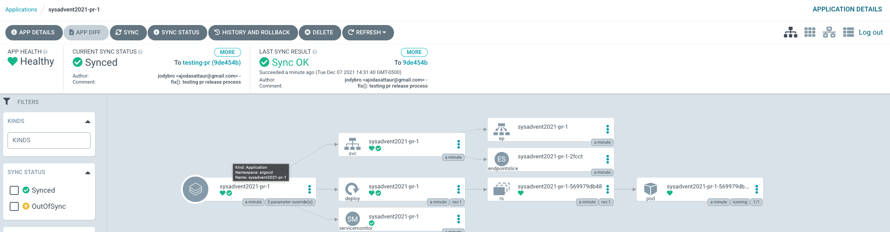

# sysadvent2021
Code for article published on grafana.com

# Pre-requisites
| Tool               | Version   |
|--------------------|-----------|
| `kubectl`          | `v1.21`   |
| Kubernetes Cluster | `v1.20.9` |
| Helm               | `v3.6.3`  |
| ArgoCD             | `v2.0.5`  |
| `kube-prometheus-stack` | `v0.50.0` |


## Intro

Something that I've been thinking about a lot recently is how to really implement the concepts of least access while also speeding up the feedback cycle in the developer workflow.
However these 2 things are not very easily intertwined as there needs to be a lot of underlying tooling/visibility to really show developers the data that they need for a sucessful PR merge.

A developer really doesn't care about the what those underlying tools are, they just want access to a system where they can:

    - See the logs of the app that they're making a change for + all other relevant apps
    - See the metrics of their app so they can properly gauge performance impact

One way to achieve this is with ephemeral environments based on PR's. The idea being that the developer opens up a PR and then automatically:

    - A new environment is spun up based on some sane defaults that you provide
    - This environment should ideally be deployed in the exact same way that dev/stage/prod are deployed, just with a few key elements different
    - This environment is labelled correctly so that the NOC/Ops teams can tell what these resources are used for
    - Integrate the environment with logging/metrics with useful tags so that the dev can easily see metrics for this given PR build

That sounds like a daunting task but through the use of Kubernetes, Helm, a CI Platform (GitHub Actions in this tutorial) and ArgoCD...we can make this a reality.

# Example app
[GitHub Repo](https://github.com/jodybro/sysadvent2021)

The example app that we're going to be deploying today is just a prometheus exporter that exports a custom metric with an overrideable label set:

    - The `version` of the app being deployed
    - The `branch` of the PR
    - The PR ID 

### Pipeline
Now that we have what we want to accomplish defined and out of the way, let's go a little more in depth on how we get there. First lets take a look at the PR pipeline in `.github/workflows/pull_requests.yml`:

```yaml

---
name: 'Build image and push PR image to ghcr'
on:
  pull_request:
    types: [assigned, opened, synchronize, reopened]
    branches:
      - main

jobs:
  build:
    name: Build
    runs-on: ubuntu-latest
    steps:
      - name: Checkout
        uses: actions/checkout@v2
      - name: Build image
        uses: docker/build-push-action@v1
        with:
          registry: ghcr.io
          username: ${{ github.repository_owner }}
          password: ${{ secrets.GITHUB_TOKEN }}
          tags: PR-${{ github.event.pull_request.number }}
```

This pipeline runs on pull requests events to the main branch. So if you open a PR/push a commit to an existing pr/reopen a closed pr/assign it to a user, this pipeline will get triggered.
It defines 2 workflows, the first of which is build. It's fairly straightforward, take the `Dockerfile` that lives in the root of our repo and build a container image out of it and tag it for use with GitHub Container Registry. The tag will be the PR ID of the current pull request.
 
The second workflow is the one where we deploy to ArgoCD:
```yaml
  deploy:
    needs: build
    container: ghcr.io/jodybro/argocd-cli:1.1.0
    runs-on: ubuntu-latest
    steps:
      - name: Log into argocd
        run: |
          argocd login ${{ secrets.ARGOCD_GRPC_SERVER }} --username ${{ secrets.ARGOCD_USER }} --password ${{ secrets.ARGOCD_PASSWORD }}
      - name: Deploy PR Build
        run: |
          argocd app create sysadvent2021-pr-${{ github.event.pull_request.number }} \
            --repo https://github.com/jodybro/sysadvent2021.git \
            --revision ${{ github.head_ref }} \
            --path . \
            --upsert \
            --dest-namespace argocd \
            --dest-server https://kubernetes.default.svc \
            --sync-policy automated \
            --values values.yaml \
            --helm-set version="PR-${{ github.event.pull_request.number }}" \
            --helm-set name="sysadvent2021-pr-${{ github.event.pull_request.number }}" \
            --helm-set env[0].value="PR-${{ github.event.pull_request.number }}" \
            --helm-set env[1].value="${{ github.head_ref }}" \
            --helm-set env[2].value="sysadvent2021-pr-${{ github.event.pull_request.number }}"
```

This workflow runs a custom image that I [wrote](https://github.com/jodybro/argocd-cli) that just wraps the `argocd` cli tool in a container and allows for any arbitrary commands to be executed against an authenticted ArgoCD instance.

It then creates a Kubernetes object of `kind: Application` which is a CRD that ArgoCD deploys into your cluster to define where you want to pull the application from and how to deploy it (helm/kustomize etc..). 


# Putting it all together
Now let's see how it all works in action.
First we'll head to our repo and create a pr against the master branch with some changes, doesn't matter what the changes are. 

Here we see that our pr has triggered a pipeline which can be viewed [here](https://github.com/jodybro/sysadvent2021/actions/runs/).
We can see that this pipeline executed successfully so if we were to go to our ArgoCD instance we should see an application with this PR ID.

So now we have 2 deployments of this example app, one should show labels for the `main` branch and one should show labels for the pr branch.

Let's verify by port-forwarding to each and see what we get back.

## Main branch

First, let's check out the main branch application:
```bash
kubectl port-forward service/sysadvent2021-main 8000:8000 
Forwarding from 127.0.0.1:8000 -> 8000
Forwarding from [::1]:8000 -> 8000
```


As you can see the branch is set to `main` and we're showing the right version.

And if we check out the state of our Application in ArgoCD:



Everything is healthy!

## PR

Now let's check the pr deployment:

```bash
kubectl port-forward service/sysadvent2021-pr-1 8000:8000 
Forwarding from 127.0.0.1:8000 -> 8000
Forwarding from [::1]:8000 -> 8000
```

This ones labels are showing the branch and the vesion from the PR!

This pod returns:


And in ArgoCD:



# Final thoughts
It really is that easy to get PR environments running in your company!